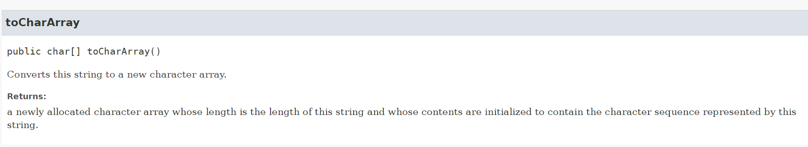
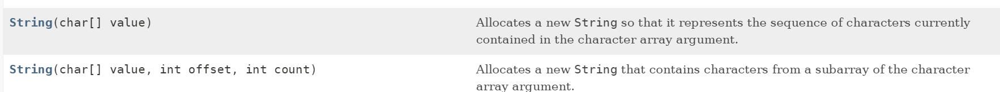
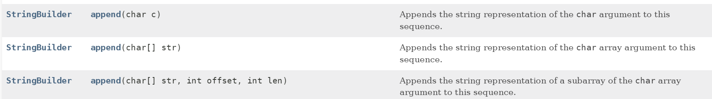

## 官方参考文档

在 [Java 参考文档](https://docs.oracle.com/en/java/javase/) 中可以找到对应 Java 版本的文档。

## 字符数组 和 字符串 互相转化

### 字符串 转 字符数组



```Java
// 使用 String 提供的 toCharArray() 方法
String str = "Hello World!";
char[] chs = str.toCharArray();

// 或者遍历 字符串，依次将字符赋值到字符数组中
String str = "Hello World!";
int n = str.length();
char[] chs = new char[n];

for (int i = 0; i < n; ++i) {
    chs[i] = s.charAt(i);
}
```

### 字符数组 转 字符串



![valueOf(char[] data) 方法_Java 17](./java-notes/valueOf_char.png)



```Java
// 使用 String 提供的构造函数，传递一个字符数组
char[] chs = new char[] {'H', 'e', 'l', 'l', 'o', ' ', 'W', 'o', 'r', 'l', 'd', '!'};
String str = new String(chs);

// 或者使用 String 提供的静态方法 valueOf(char[] data)
char[] chs = new char[] {'H', 'e', 'l', 'l', 'o', ' ', 'W', 'o', 'r', 'l', 'd', '!'};
String str = String.valueOf(chs);

// 或者使用 StringBuilder() 创建
char[] chs = new char[] {'H', 'e', 'l', 'l', 'o', ' ', 'W', 'o', 'r', 'l', 'd', '!'};
StringBuilder sb = new StringBuilder();
sb.append(chs);
String str = sb.toString();
```

## 优先队列


```Java
// 创建一个按照自然排序的队列（小根堆）
PriorityQueue<Integer> pq = new PriorityQueue<Integer>();

// 自定义排序（eg: 从大到小，大根堆）
PriorityQueue<Integer> pq = new PriorityQueue<Integer>((o1, o2) -> o2 - o1);
```
